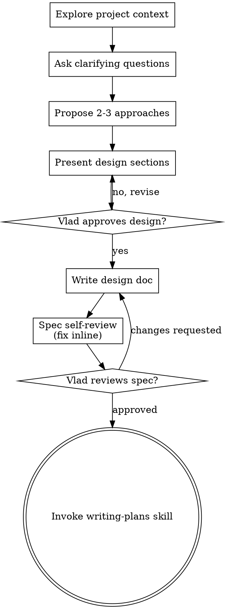

# Brainstorming Ideas Into Designs

Help turn ideas into fully formed designs and specs through natural collaborative dialogue with Vlad.

Start by understanding the current project context, then ask Vlad questions one at a time to refine the idea. Once you understand what you're building, present the design and get Vlad's approval.

<HARD-GATE>
Do NOT invoke any implementation skill, write any code, scaffold any project, or take any implementation action until you have presented a design and Vlad has approved it. This applies to EVERY project regardless of perceived simplicity.
</HARD-GATE>

## Anti-Pattern: "This Is Too Simple To Need A Design"

Every project goes through this process. A todo list, a single-function utility, a config change — all of them. "Simple" projects are where unexamined assumptions cause the most wasted work. The design can be short (a few sentences for truly simple projects), but you MUST present it and get approval.

## Checklist

You MUST create a task for each of these items and complete them in order:

1. **Explore project context** — check files, docs, recent commits
2. **Ask clarifying questions** — one at a time, understand purpose/constraints/success criteria
3. **Propose 2-3 approaches** — with trade-offs and your recommendation
4. **Present design** — in sections scaled to their complexity, get Vlad's approval after each section
5. **Write design doc** — save to `tasks/<TASK-NUM>-task-<feature-name>/SPEC-<SPEC-NUM>-<spec-name>.md` (Vlad's preferences override). Do NOT commit — Vlad commits.
6. **Spec self-review** — quick inline check for placeholders, contradictions, ambiguity, scope, backward compatibility, scope creep, sensitive data (see below)
7. **Vlad reviews written spec** — ask Vlad to review the spec file before proceeding
8. **Transition to implementation** — invoke writing-plans skill to create implementation plan

## Process Flow



**The terminal state is invoking writing-plans.** Do NOT invoke frontend-design, mcp-builder, or any other implementation skill. The ONLY skill you invoke after brainstorming is writing-plans.

For visual content during brainstorming, use the tools Vlad has set up — see the Visual Design section below.

## The Process

**Understanding the idea:**

- Check out the current project state first (files, docs, recent commits)
- Before asking detailed questions, assess scope: if the request describes multiple independent subsystems (e.g., "build a platform with chat, file storage, billing, and analytics"), flag this immediately. Don't spend questions refining details of a project that needs to be decomposed first.
- If the project is too large for a single spec, help Vlad decompose into sub-projects: what are the independent pieces, how do they relate, what order should they be built? Then brainstorm the first sub-project through the normal design flow. Each sub-project gets its own spec → plan → implementation cycle.
- For appropriately-scoped projects, ask questions one at a time to refine the idea
- Prefer multiple choice questions when possible, but open-ended is fine too
- Only one question per message - if a topic needs more exploration, break it into multiple questions
- Focus on understanding: purpose, constraints, success criteria

**Exploring approaches:**

- Propose 2-3 different approaches with trade-offs
- Present options conversationally with your recommendation and reasoning
- Lead with your recommended option and explain why

**Presenting the design:**

- Once you believe you understand what you're building, present the design
- Scale each section to its complexity: a few sentences if straightforward, up to 200-300 words if nuanced
- Ask after each section whether it looks right so far
- Cover: architecture, components, data flow, error handling, testing
- Be ready to go back and clarify if something doesn't make sense

**Design for isolation and clarity:**

- Break the system into smaller units that each have one clear purpose, communicate through well-defined interfaces, and can be understood and tested independently
- For each unit, you should be able to answer: what does it do, how do you use it, and what does it depend on?
- Can someone understand what a unit does without reading its internals? Can you change the internals without breaking consumers? If not, the boundaries need work.
- Smaller, well-bounded units are also easier for you to work with - you reason better about code you can hold in context at once, and your edits are more reliable when files are focused. When a file grows large, that's often a signal that it's doing too much.

**Working in existing codebases:**

- Explore the current structure before proposing changes. Follow existing patterns.
- Where existing code has problems that affect the work (e.g., a file that's grown too large, unclear boundaries, tangled responsibilities), include targeted improvements as part of the design - the way a good developer improves code they're working in.
- Don't propose unrelated refactoring. Stay focused on what serves the current goal.

## After the Design

**Documentation:**

- Write the validated design (spec) to `tasks/<TASK-NUM>-task-<feature-name>/SPEC-<SPEC-NUM>-<spec-name>.md`
  - (Vlad's preferences for spec location override this default)
- Do NOT commit the spec yourself. Tell Vlad the file is ready and let him commit it (per the "ASK before committing" rule in CLAUDE.md).

**Spec Self-Review:**
After writing the spec document, look at it with fresh eyes:

1. **Placeholder scan:** Any "TBD", "TODO", incomplete sections, or vague requirements? Fix them.
2. **Internal consistency:** Do any sections contradict each other? Does the architecture match the feature descriptions?
3. **Scope check:** Is this focused enough for a single implementation plan, or does it need decomposition?
4. **Ambiguity check:** Could any requirement be interpreted two different ways? If so, pick one and make it explicit.
5. **Backward compatibility check:** Does the spec quietly assume backward compat, shims, or deprecation paths? If yes, surface it explicitly to Vlad — never bake backward compat into the design without approval.
6. **Scope creep check:** Re-read the original idea Vlad described. Did the spec accumulate features, options, or polish beyond what he asked for? Strip them out or surface them for explicit approval.
7. **Sensitive data check:** Does the spec require reading `.env`, secrets, credentials, or environment variables? If yes, the spec must instruct the implementer to ask Vlad for the value rather than reading it.

Fix any issues inline. No need to re-review — just fix and move on. If a check surfaces something that needs Vlad's input (backward compat, scope, sensitive data), pause and ask before continuing.

**Vlad's Review Gate:**
After the spec self-review passes, ask Vlad to review the written spec before proceeding:

> "Spec written to `<path>`. Please review it and let me know if you want to make any changes before we start writing out the implementation plan. (I haven't committed it — that's yours to do.)"

Wait for Vlad's response. If he requests changes, make them and re-run the spec self-review. Only proceed once Vlad approves.

**Implementation:**

- Invoke the writing-plans skill to create a detailed implementation plan
- Do NOT invoke any other skill. writing-plans is the next step.

## Key Principles

- **One question at a time** - Don't overwhelm with multiple questions
- **Multiple choice preferred** - Easier to answer than open-ended when possible
- **YAGNI ruthlessly** - Remove unnecessary features from all designs
- **Explore alternatives** - Always propose 2-3 approaches before settling
- **Incremental validation** - Present design, get approval before moving on
- **Be flexible** - Go back and clarify when something doesn't make sense

## Visual Design

Two modes. Default to markdown. Escalate to HTML when richer visualization actually helps Vlad understand or decide.

### Default: Markdown + Mermaid (inline in the spec)

Use this for almost everything:
- Architecture diagrams, data flow, sequence diagrams, state machines, ERDs, flowcharts → ```` ```mermaid ```` blocks inside the spec.
- Decisions, tradeoffs, requirements, comparisons → markdown text, tables, lists.
- Static screen layouts where wireframe fidelity is enough → markdown table or simple ASCII layout.

The spec stays one file. Mermaid renders natively in most clients. Diff-friendly, committable, reviewable.

### Escalate to HTML/CSS/JS when one of these is true

- **Animations would clarify it.** Execution flow, request lifecycle, state transitions, "before / during / after" sequences. Static boxes lose information that animation conveys.
- **Edge case visualization.** Multiple states side-by-side, success vs. error paths, "what happens when X fails," loading/empty/populated/error variants of a screen.
- **Execution visualization.** Stepping through an algorithm, walking through a flow with intermediate states, click-through scenarios.
- **Embedded UI inside diagrams.** Flow that shows actual screen thumbnails between nodes ("user clicks here → this screen appears").
- **Interactive exploration.** Hover-for-details, expandable nodes, filterable views — when the visualization has more detail than fits on one static page.
- **Visual richness beyond what markdown expresses.** Custom styling that carries meaning, color-coded grouping, layered annotations.

If none of these apply, stay in markdown.

### HTML file conventions

- **Location:** alongside the spec. Same folder, parallel name:
  - Spec: `tasks/<TASK-NUM>-task-<feature-name>/SPEC-<SPEC-NUM>-<spec-name>.md`
  - Visual: `tasks/<TASK-NUM>-task-<feature-name>/SPEC-<SPEC-NUM>-<spec-name>.html`
- **Self-contained single file.** All CSS and JS inline (`<style>` and `<script>` blocks). No external dependencies, no CDN links — opens offline in any browser.
- **Link from the spec.** The markdown spec includes a line like `**Visual:** [SPEC-<NUM>-<spec-name>.html](./SPEC-<NUM>-<spec-name>.html)` near the top so Vlad knows it exists.
- **Iterate by versioning.** New attempt → `SPEC-<NUM>-<spec-name>-v2.html`. Don't overwrite previous versions during brainstorming — Vlad may want to compare.
- **Keep it focused.** One HTML file per spec, not one per question. Multiple visualizations live as sections within the same file.
- **No commit by you.** Vlad commits the spec and the visual together when he's ready (per the "ASK before committing" rule).

### The judgment call

Before reaching for HTML, ask: would Vlad genuinely understand this better seeing it animated/interactive than reading markdown + a Mermaid diagram? If yes, escalate. If you're escalating because it would *look nicer*, don't — stay in markdown.
